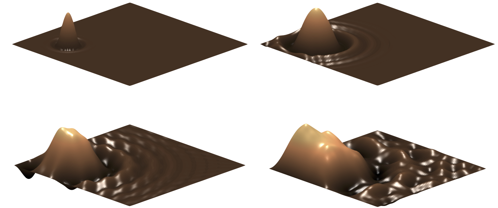
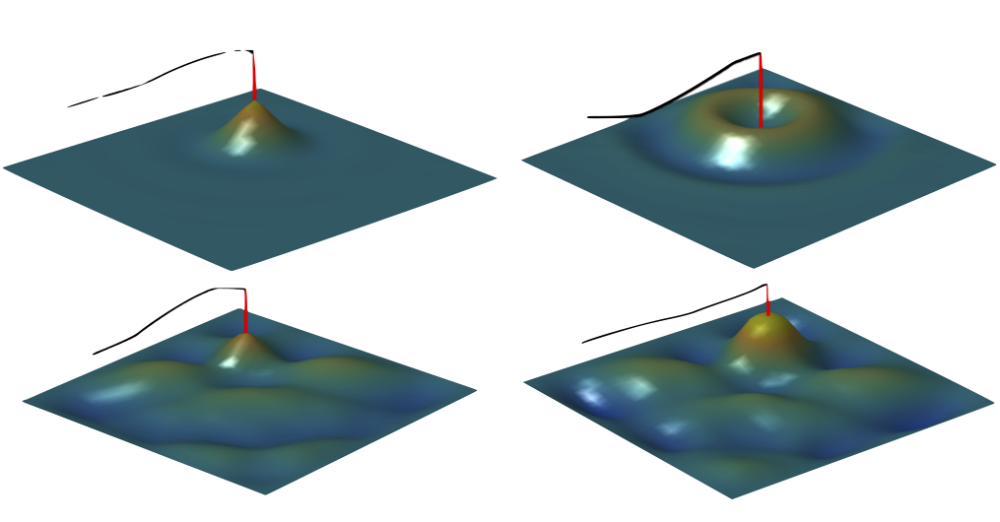

# Coupled Finite Difference Kirchhoff Plate And String

A collection of Finite Difference models coupling a Kirchhoff Thin Plate and Stiff String along with related functions

<!-- TOC depthFrom:1 depthTo:6 withLinks:1 updateOnSave:1 orderedList:0 -->

- [Coupled Finite Difference Kirchhoff Plate And String](#coupled-finite-difference-kirchhoff-plate-and-string)
	- [Contents](#contents)
		- [`schemes`](#schemes)
		- [`instrument files`](#instrument-files)
		- [`calibration files`](#calibration-files)
		- [`midi`](#midi)
		- [`functions`](#functions)
		- [`analysis`](#analysis)
		- [`documents`](#documents)
	- [Example Plots](#example-plots)
	- [Version Notes](#version-notes)

<!-- /TOC -->

## Contents

An environment setup script has been provided to ensure that all the required folders and functions are visible.

### `schemes`

The individual finite difference models. Each scheme is currently bundled with the relevant instrument file though others are included

### `instrument files`

template instrument files for each model

### `calibration files`

Files containing arrays of coefficients that were calibrated against real piano recordings.

### `midi`

A selection of midi files for use with models that generate audio from MIDI data.

### `functions`

useful functions used in the model process

### `analysis`

files for generating plots for analysing model behaviour.

### `documents`

supporting documentation in pdf and markdown format

## Example Plots

|  |  |
| -------------------------------- | ---------------------------------- |
|                                  |                                    |

## Version Notes

NOTE: The included files were created with MATLAB 2016b on macOS. Some behaviour may be slightly different, particularly with
vector `.\*` element-wise multiplication. I have routed out most of these but there may still be a few lurking in bushes.
